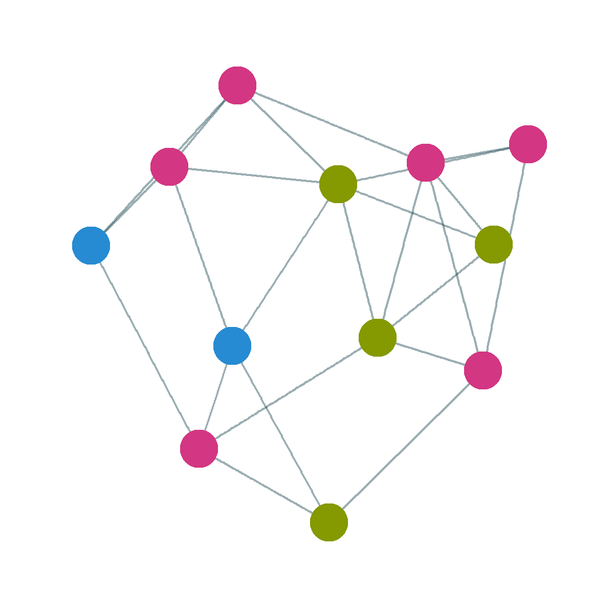

```{r, include=FALSE}
knitr::opts_chunk$set(
  results='asis', 
  echo = FALSE
)

library(glue)
library(tidyverse)

# Set this to true to have links turned into footnotes at the end of the document
PDF_EXPORT <- FALSE

# Holds all the links that were inserted for placement at the end
links <- c()

source('parsing_functions.R')

# Load csv with position info
position_data <- read_csv('positions.csv')
```


```{r}
# When in export mode the little dots are unaligned, so fix that. 
if(PDF_EXPORT){
  cat("
  <style>
  :root{
    --decorator-outer-offset-left: -6.5px;
  }
  </style>")
}
```


Aside
================================================================================


{width=100%}

```{r eval=FALSE}
# When in export mode the little dots are unaligned, so fix that. 
if(PDF_EXPORT){
  cat("View this CV online with links at _nickstrayer.me/cv_")
} else {
  cat("[<i class='fas fa-download'></i> Download a PDF of this CV](https://github.com/dineshladi/cv-master/blob/master/DineshLadi_Resume.pdf)")
}
```

Contact {#contact}
--------------------------------------------------------------------------------


- <i class="fa fa-envelope"></i> ladidinesh@gmail.com
- <i class="fa fa-twitter"></i> <a href= "https://twitter.com/ladidinesh">ladidinesh</a>
- <i class="fa fa-github"></i> <a href= "https://github.com/dineshladi">dineshladi</a>
- <i class="fa fa-phone"></i> (+91) 7738981316
- <i class="fa fa-map-marker"></i> Bangalore, India


Skills/Tools {#skills}
--------------------------------------------------------------------------------

```{r}
skills <- tribble(
  ~skill,               ~level,
  "R",                  4.5,
  "SQL",                5,
  "Python",             4.5,
  "Bash",               3.5,
  "Excel",              4,
  "Hive",               3.5,
  "Spark",              3,
  "AWS",                3
)

build_skill_bars(skills)
```


Courses {#courses}
--------------------------------------------------------------------------------

```{r}
courses <- data.frame(course = c("Statistical Learning (Stanford)", "Deep Learning Specialization (deeplearning.ai)", "Data Scientist Track (Dataquest.io)", "Introduction to Corporate Finance"), stringsAsFactors = F) %>% glue::glue_data("<li>{course}</li>")

glue::glue("<ul>",glue::glue_collapse(courses,sep = "\n<br>"),"</ul>")

```

Main
================================================================================

Dinesh Ladi {#title}
--------------------------------------------------------------------------------

```{r eval=TRUE}
intro_text <- "I have almost 4 years experience in data analyses, machine learning and data visualization. Conceptualized and built a data tool within a span of 4 months and sold it to one of the unicorns in the country. 

Currently looking for a data science role where I can build data driven tools using machine learning, data analyses and data visualization to help companies/people leverage data"

cat(sanitize_links(intro_text))
```

Industry Experience {data-icon=suitcase}
--------------------------------------------------------------------------------

```{r}
print_section(position_data, 'industry_positions')
```


Education {data-icon=graduation-cap data-concise=true}
--------------------------------------------------------------------------------

```{r}
print_section(position_data, 'education')
```

<br>
<br>
<br>

```{r}
if(PDF_EXPORT){
  cat("
  
Links {data-icon=link}
--------------------------------------------------------------------------------

<br>


")
  
  walk2(links, 1:length(links), function(link, index){
    print(glue('{index}. {link}'))
  })
}
```


